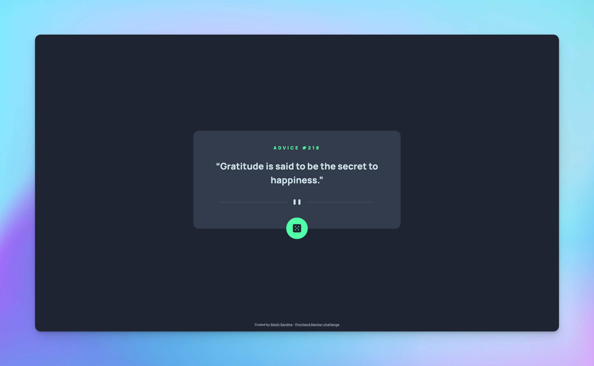
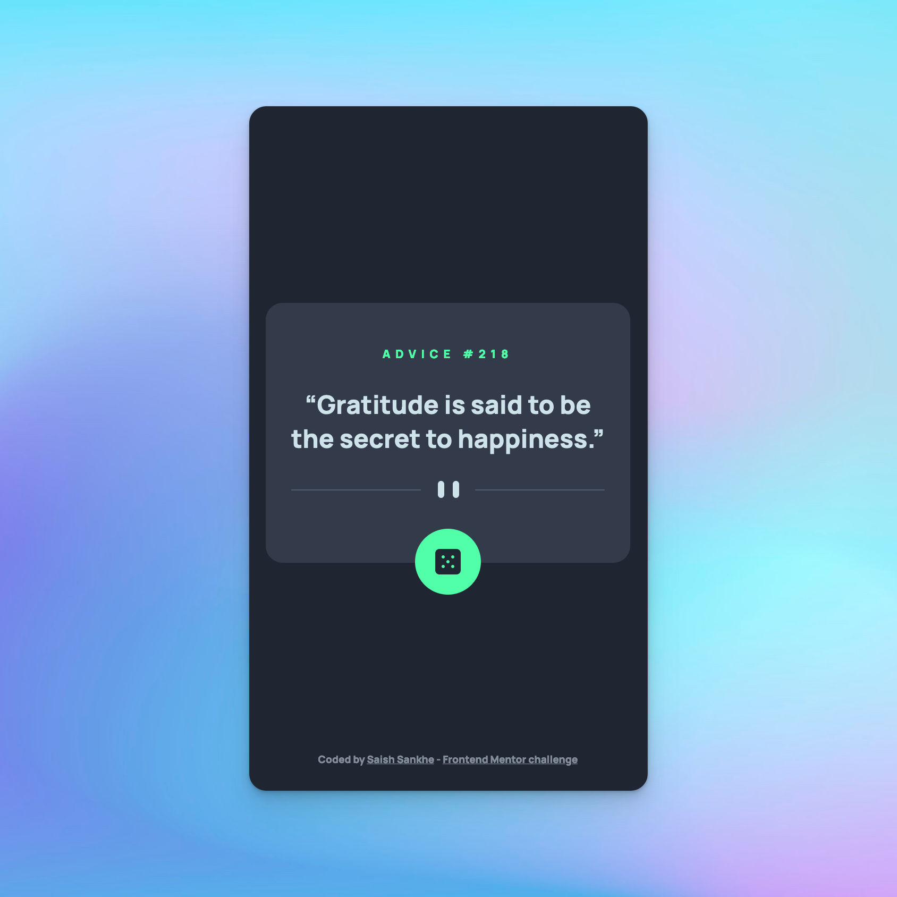

# Advice generator app

This is my solution to the [Advice generator app challenge on Frontend Mentor](https://www.frontendmentor.io/challenges/advice-generator-app-QdUG-13db).

## Table of contents

- [Overview](#overview)
  - [The challenge](#the-challenge)
  - [Screenshot](#screenshot)
  - [Links](#links)
- [My process](#my-process)
  - [Built with](#built-with)
  - [What I learned](#what-i-learned)
  - [Continued development](#continued-development)

## Overview

Build out a advice generator app using the [Advice Slip API](https://api.adviceslip.com/).

### The challenge

Users should be able to:

- View the optimal layout for the app depending on their device's screen size
- See hover states for all interactive elements on the page
- Generate a new piece of advice by clicking the dice icon

I have also added the capability to copy the advice to clipboard.

### Screenshots

  

### Links

- Solution URL: [GitHub](https://github.com/SaishSankhe/advice-generator)
- Live Site URL: [Vercel](https://advice-generator-saishsankhe.vercel.app/)

## My process

### Built with

- [Next.js](https://nextjs.org/) - React framework
- Semantic HTML5 markup
- [SCSS](https://sass-lang.com/) - CSS
- Flexbox
- [Advice Slip API](https://api.adviceslip.com/)

### What I learned

This is the first time I have used Next.js for a project. It was great fun to learn something new and implement the challenge. I got to learn different ways of content rendering like Server-Side Rendering and Static Site Generation. I also learned how to create a link preview for social media link sharing and now this website has a working link preview as well.

### Continued development

I am planning to add a sharing option where a user can click on share and the image of current advice will be available for sharing.
